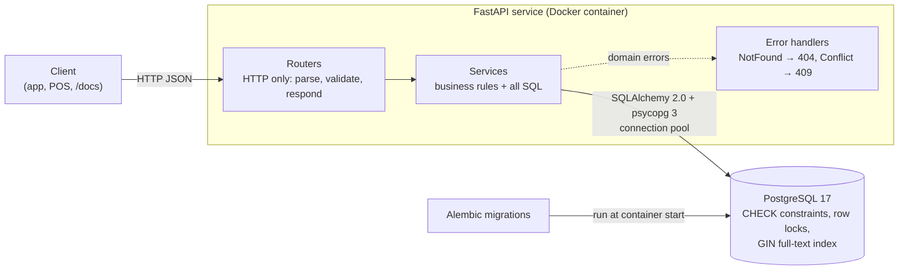
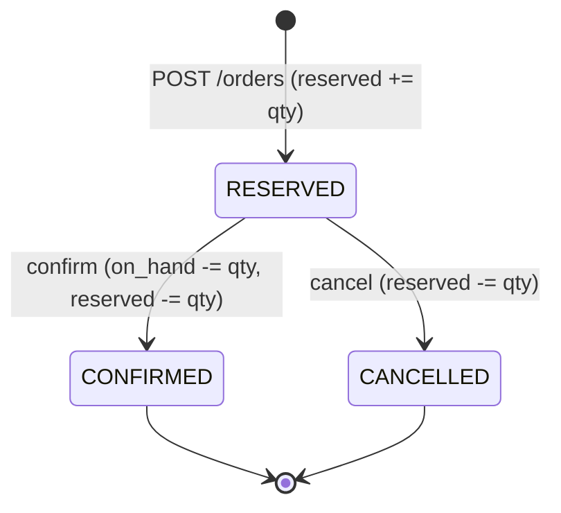

# Store Inventory & Replenishment Service

[](https://github.com/samarthkumble/store-inventory-service/actions/workflows/ci.yml)

A REST microservice for a home-improvement retailer's store inventory: per-store stock levels, shelf locations (aisle and bay), ranked product search, and order reservations that **cannot oversell, even under heavy concurrent load**.

Built with Python 3.12, FastAPI, PostgreSQL 17, SQLAlchemy 2.0, Alembic, Pydantic, pytest, Docker Compose and GitHub Actions.

## The problem

A store has 10 units of a tap left and 50 customers try to buy one at the same moment. The obvious code (read the stock, check it, write the new value) lets many requests read the same old value, pass the check, and overwrite each other's writes. Customers are promised stock that doesn't exist, and the database still looks perfectly valid.

This service makes the check and the write a single atomic step, and proves it with a test that fires 50 truly simultaneous HTTP requests at a real server and database. The naive version runs through the same test to show the bug actually happening.

## Architecture



Order lifecycle (every transition is a conditional `UPDATE ... WHERE status = 'RESERVED'`, so a double-click can't apply it twice):



## Run it

Requires Docker Desktop.

```bash
docker compose up -d --build --wait                      # Postgres + API, waits until both are healthy
docker compose exec api python -m scripts.seed --reset   # 3 stores, 200 products, 561 stock rows
```

Open **http://localhost:8000/docs** for interactive API docs.

### Run the tests

```bash
python -m venv .venv
# Windows: .venv\Scripts\activate    macOS/Linux: source .venv/bin/activate
pip install -r requirements-dev.txt
docker compose up -d db
pytest --cov
```

Tests create and migrate their own `inventory_test` database, so development data is never touched.

## API

| Method | Path | What it does |
|---|---|---|
| `GET` | `/stores` | List stores |
| `GET` | `/stores/{store_id}/products?q=&category=` | Full-text product search in one store, most relevant first, with availability, aisle and bay |
| `GET` | `/stores/{store_id}/stock/{sku}` | `on_hand`, `reserved`, `available` (= on_hand − reserved) and location |
| `POST` | `/products` | Create a product (409 if the SKU exists) |
| `GET` / `PATCH` / `DELETE` | `/products/{sku}` | Read, partially update, soft-delete |
| `GET` | `/products?category=` | List the catalogue (paginated) |
| `POST` | `/orders` | Reserve stock for one or more items, all or nothing (409 if any item is short) |
| `GET` | `/orders/{id}` | Order with line items and total |
| `POST` | `/orders/{id}/confirm` | Sold: units leave the shelf |
| `POST` | `/orders/{id}/cancel` | Released: units become available again |
| `GET` | `/health` | Liveness plus a database round trip |

### Examples

Search for "tap" at store 1. Full-text search matches whole words, so "Masking Tape" is not returned:

```bash
curl "http://localhost:8000/stores/1/products?q=tap&limit=2"
```
```json
[
  {"sku": "PLB-00024", "name": "Pillar Tap, Chrome-plated Brass, Long Body", "category": "plumbing",
   "price": "1429.00", "available": 41, "aisle": "14", "bay": "C06"},
  {"sku": "PLB-00025", "name": "Pillar Tap, Chrome-plated Brass, Short Body", "category": "plumbing",
   "price": "1189.00", "available": 71, "aisle": "13", "bay": "A08"}
]
```

Reserve two items in one order:

```bash
curl -X POST http://localhost:8000/orders -H "Content-Type: application/json" \
  -d '{"store_id": 1, "items": [{"sku": "PLB-00024", "qty": 2}, {"sku": "PLB-00037", "qty": 1}]}'
```

If any item is short, nothing is reserved and the response says exactly why:

```json
{"detail": "Out of stock: PLB-00027 at store 1 (requested 50, available 3)",
 "sku": "PLB-00027", "requested": 50, "available": 3}
```

## Design decisions

**Concurrency**
- **Atomic conditional update.** A reservation is one statement: `UPDATE stock SET reserved = reserved + :qty WHERE store_id = :s AND sku = :k AND on_hand - reserved >= :qty`. The row lock makes concurrent updates wait, and Postgres re-checks the `WHERE` clause against the newest row version after the wait. Zero rows updated means 409.
- **`SELECT ... FOR UPDATE` as the alternative.** It is also implemented and tested, and can be selected with `RESERVATION_STRATEGY=for_update`. It suits decisions too complex for one `WHERE` clause, at the cost of an extra round trip and a lock held while application code runs.
- **Deadlock prevention by lock ordering.** Multi-item orders lock stock rows sorted by SKU, so two orders for "X, Y" and "Y, X" queue up instead of deadlocking. A test creates a real deadlock with opposite lock order, then shows sorted order avoids it.
- **All or nothing.** All items of an order are reserved in one transaction. If any item fails, everything rolls back.

**Data model**
- **Shelf location lives on `stock`, not `products`.** Aisle and bay depend on (store, SKU): the same product sits in different aisles in different stores.
- **`available` is computed, never stored**, so there is a single source of truth.
- **CHECK constraints** (`reserved <= on_hand`, no negatives) are a safety net against bugs. They cannot catch lost updates, which is why the atomic update matters.
- **Money is `NUMERIC(10,2)` / `Decimal`, serialised as a JSON string**, never a float.
- **Order lines snapshot `unit_price`**, so later price changes don't rewrite history.
- **Soft delete** for products, because old orders still reference them. UUID order IDs, so IDs in URLs can't be guessed.

**Search**
- **Postgres full-text search with a GIN index.** It replaced `ILIKE '%tap%'`, which returned 14 results for "tap", 7 of them tape. Stemming means "taps" finds taps. `websearch_to_tsquery` supports `pillar tap -steel`. A test checks with `EXPLAIN` that the index is used.

**Engineering**
- **Layered:** routers (HTTP) → services (rules + SQL) → models. Services raise domain errors, and one place maps them to status codes.
- **Hand-written Alembic migrations**, with `alembic check` in CI to prove they match the models.
- **Tests run on real Postgres, never SQLite.** SQLite serialises writers, which would hide the concurrency bugs.
- **Docker:** dependencies are installed before the code is copied (layer caching), the container runs as a non-root user, and `exec uvicorn` gives a graceful shutdown.
- **CI:** migrations, `alembic check`, tests with a 90% coverage gate, then the image is built and the running stack is smoke-tested.

## Results

All numbers below were measured on a Windows 11 laptop. The API ran in Docker Desktop (WSL 2) as a single uvicorn process, and the load came from a client on the same machine.

**Tests:** 74 passing (27 unit tests that need no database, 47 integration tests against Postgres). Coverage is 98.97% of lines and branches in `app/` and `scripts/` (excluding the manual `bench.py` tool). CI fails below 90%.

**Overselling test:** 50 simultaneous `POST /orders` for the last 10 units of one SKU.

| Strategy | Success (201) | Rejected (409) | Final stock (on hand / reserved / available) |
|---|---|---|---|
| Atomic conditional `UPDATE` | 10 | 40 | 10 / 10 / 0 |
| `SELECT ... FOR UPDATE` | 10 | 40 | 10 / 10 / 0 |
| Naive read-then-write | **50** | 0 | 10 / **5** / 5 (40 units oversold, lost updates) |

**Other concurrency tests:** 20 simultaneous confirms of one order gave exactly 1 success, and stock moved once. 40 racing multi-item orders in opposite SKU order completed with 0 deadlocks. Opposite lock order without sorting was aborted by Postgres with `deadlock detected`.

**Response times:** 1 client, 200 sequential requests per endpoint, after warm-up.

| Endpoint | Median | p95 | p99 |
|---|---|---|---|
| `GET /health` | 11.4 ms | 13.9 ms | 16.2 ms |
| `GET /stores/1/stock/PLB-00024` | 19.8 ms | 23.7 ms | 27.9 ms |
| `GET /stores/1/products?q=tap` | 26.0 ms | 31.3 ms | 36.9 ms |
| `POST /orders` (1 item) | 28.0 ms | 34.0 ms | 37.9 ms |

**Throughput:** 20 concurrent clients, 1,000 search requests, 75 requests/s, median 256 ms, p95 368 ms, 0 errors.

Reproduce these with `python -m scripts.bench` against the running stack.

## Project structure

```
app/
  core/        settings (env vars) and domain errors
  db/          SQLAlchemy base (naming conventions) and sessions
  models/      tables: stores, products, stock, orders, order_items
  schemas/     Pydantic request and response contracts
  services/    business logic: catalogue, stock/search, reservations, orders
  routers/     HTTP endpoints
alembic/       migrations (0001 schema, 0002 full-text index)
scripts/       seed.py (deterministic data), bench.py (latency/throughput)
tests/
  unit/        no database needed
  integration/ real Postgres: API, services, concurrency, seed script
```

## Possible next steps

Not built yet: a replenishment service consuming `StockChanged` events (Redis Streams, mapping to Kafka topics and consumer groups) to suggest reorders from moving-average demand; caching of hot product lookups; an AI product finder that validates model output against the catalogue; prefix and typo-tolerant search (`pg_trgm`).
